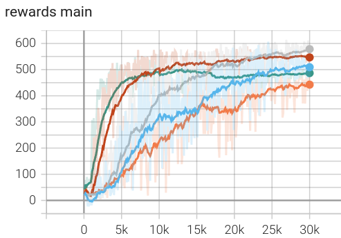
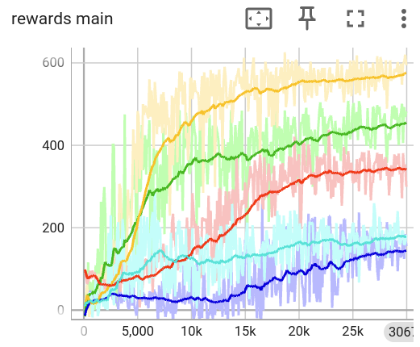
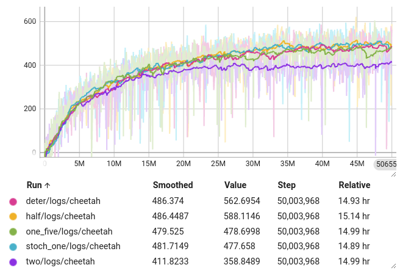

# GAIL WM

NOTE (12/16/24): This is in a working state and will be updated over the course of the next few weeks.

This is an implementation of GAIL using PPO.

This work is authored by Ted Staley and is Copyright © 2024 The Johns Hopkins University Applied Physics Laboratory LLC, please see the LICENSE file.

## Data

For development we use the HalfCheetah-v4 environment, for which we train an expert using Soft-Actor Critic (SAC). We then collect sets of 50 trajectories from the expert using different amounts of noise. More noise results in lower performance but perhaps a greater amount of data about making and correcting small mistakes:

- **deterministic**: sampled directly from the expert policy's mean. (average performance 687 +- 27)
- **stochastic-half**: sampled from expert policy with one-half the given standard deviation. (668 +- 30)
- **stochastic-one**: sampled from expert policy with the given standard deviation. (630 +- 36)
- **stochastic-one_five**: sampled from expert policy with 1.5x the given standard deviation. (540 +- 46)
- **stochastic-two**: sampled from expert policy with twice the given standard deviation. (422 +- 51)

These are available as pickle files in the ./data/ folder. Each file is a list of trajectories, with each trajectory consisting of a list of dictionaries: {"state":state, "action":action, "reward":reward, "done":done}.

Episodes are only 100 steps long (5000 steps total) because future work will examine learning from imagery, and the "floor" in the environment only lasts for about 100 steps (the agent walks beyond the floor at some point). This is major visual change partway through the episode, so to avoid this in future work we use many short episodes.

## Behavior Cloning (BC)

In the ./bc/ folder is a simple BC routine to baseline other methods. This learns very quickly and does alright on the noisy expert demonstrations.

Using MLPs with 2 hidden layers and width 64 (taking best of 3 trials- in general these were highly variable in performance):

Standard deviations of data: deterministic (orange), 0.5 (blue), 1.0 (gray), 1.5 (red), 2.0 (green)

There is possibly an inverse relationship between network size and performance, which is very interesting. At large widths, the networks clearly underperform:

We have width 16 (red), width 64 (yellow, best), width 256 (green), width 1024 (cyan), width 4096 (blue, worst). Sometimes width 256 also worked well, but width 64 was the most reliable.

I also tried:

- A "slow" policy with polyak averaging, which converged faster than the other policy but was not significantly better in the end
- A Gaussian head that tried to maximize the probability of the expert action. This fared about the same as the vanilla version.

### Notes

Clearly having some variability / error in the demonstration data is important. This is very high-quality data that maps exactly onto the target environment, but there was much better performance when training from standard_dev=1.0 compared to deterministic. Additionally, there was utility in using a simpler network.

## GAIL (PPO)

See `./gail/gail.py`.

GAIL with PPO uses a discriminator to supply rewards for reinforcement learning. At each step, the reward is proportional to how well the discriminator (mis)classifies the transition. If it thinks that a given (s,a) tuple resembles the expert, we get a high reward. This implementation is built over my PPO implementation that I altered from SpinningUp.

These runs did not reach the full performance of the original expert, but they were very consistent. 

It does seem like performance continues to improve if left to run for a long time:

TODO

### Notes

By default the discriminator uses a binary classification (sigmoid) as well as a gradient penalty. I also tried a WGAN which maps to arbitrary outputs rather than [0-1], but I suspect this is a bad idea for RL, as it essentially means the reward function has a non-static range during training.

## GAIL (RSSM)

TODO
